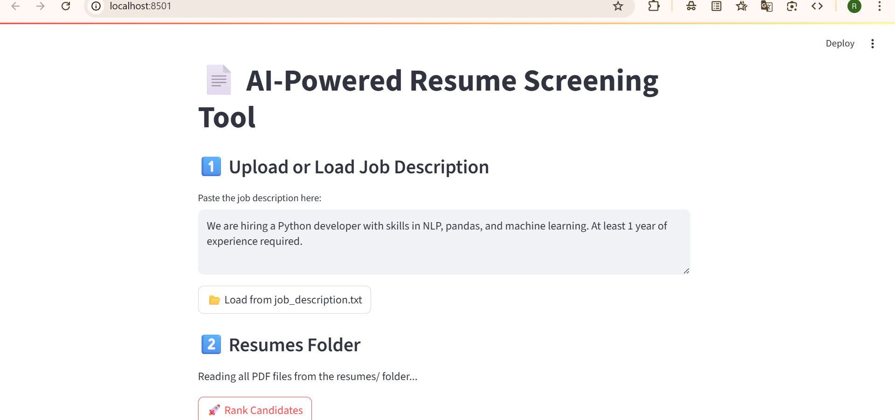
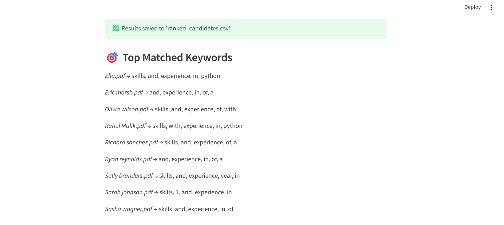
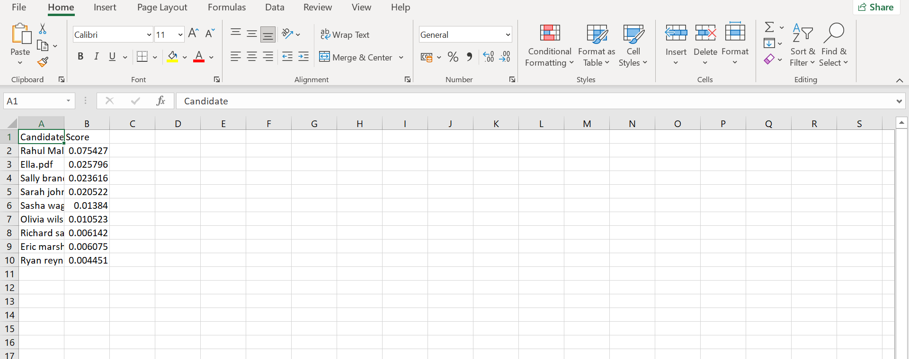

A smart web app built using *Streamlit* and *Python, capable of reading PDF resumes, comparing them to a job description using NLP, and ranking the candidates based on relevance. It can even **send emails to top candidates* and *export CSV results*.

---

## 📌 Features

- 📤 Upload or paste a job description
- 📂 Automatically read all resumes from /resumes folder
- 🧠 Extract resume content using PyMuPDF
- 🧮 Match resumes using TF-IDF + Cosine Similarity
- 📊 Rank candidates based on match score
- 📩 Automatically email top 3 shortlisted candidates
- 📁 Download results as a .csv file

---

## 🛠 Tech Stack

- Python 3.11
- Streamlit
- spaCy
- scikit-learn
- pandas
- PyMuPDF
- smtplib (for email)

---

## 🚀 How to Run Locally

1. Clone the repository  
   ```bash
   git clone https://github.com/scientrjx/resume-screening-tool.git
   cd resume-screening-tool

## Create Virtual environment 

   python -m venv venv
source venv/Scripts/activate  

(For Windows)

## Install dependencies
pip install -r requirements.txt
python -m spacy download en_core_web_sm
 
## Run the app
streamlit run app.py

## Screenshots

| 
  
  ### Streamlit Web app
  
  ###  Matching keywords
  
  ### Ranking candidate

[](https://www.linkedin.com/in/raju-kumar-0227872b1?utm_source=share&utm_campaign=share_via&utm_content=profile&utm_medium=android_app)

🚀 About Me --<>>>
 <I>RJX</I>
